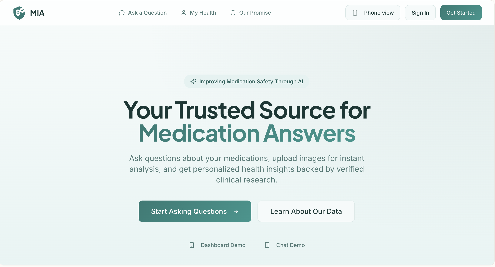
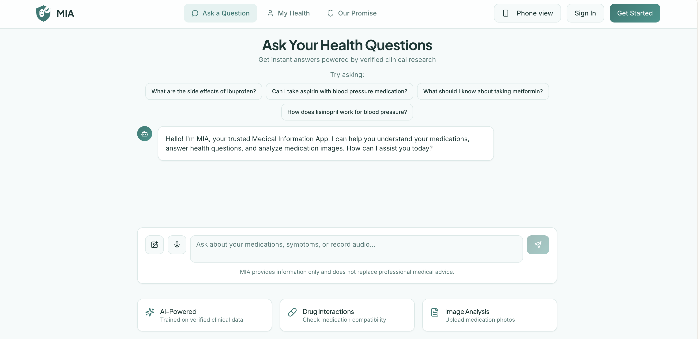
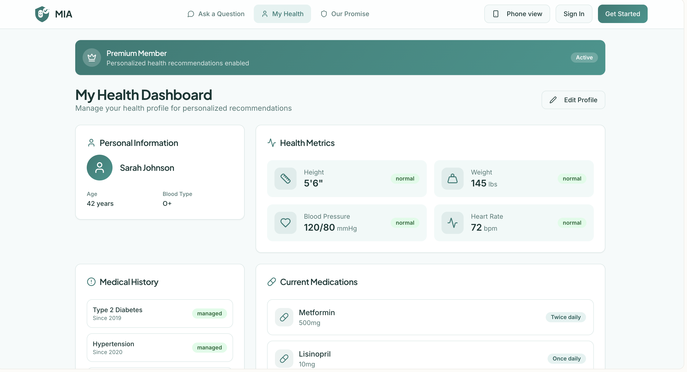

# MIA — Medical Information App

   

MIA is a prototype of a **specialized medical-information assistant** designed to be deployed by pharmaceutical companies as a verified, trustworthy alternative to general-purpose LLMs for medication and health questions. Built as a class project exploring how AI is reshaping customer engagement in the pharma and healthcare industry.

**[View the live prototype →][(https://id-preview--6675cd29-6b32-4afe-952f-90d739b33a64.lovable.app/)**

---

## The Problem
A growing share of Americans regularly turn to general-purpose LLMs like ChatGPT for medical and medication advice. As these tools have matured, their built-in disclaimers about not being qualified medical professionals have steadily decreased and documented cases now exist of patients suffering serious side effects after following bad health advice generated by commonly used models like ChatGPT, Claude, etc.

## The Solution
A **pharma-developed, specialized healthcare LLM** trained exclusively on verified data from medication research and development cycles, embedded inside a digital patient file with a clean consumer interface.

## Prototype Walkthrough

### Homepage — Trusted Source for Medication Answers

The landing page positions MIA as a verified source for medication answers, with primary calls-to-action to start a conversation or learn about the data backing the model. The phone-view toggle in the top right demonstrates responsive mobile design.

### Ask a Question — Conversational Medication Assistant

A chat interface for medication and health questions, modeled on the conversational pattern users already know from ChatGPT and Claude. Features include suggested starter prompts, image upload for medication photo analysis, and voice input. Every screen carries a clear disclaimer: *"MIA provides information only and does not replace professional medical advice."*

### My Health — Personalized Patient Dashboard

The Premium tier in action. The patient profile holds personal information, health metrics, medical history, and current medications, giving the LLM the context it needs to deliver answers tailored to the individual.
## Tools & Technologies
- **Lovable** — AI-assisted product design and code generation
- **React + TypeScript** — component-based frontend with type safety
- **Vite** — build tooling
- **Tailwind CSS** + **shadcn/ui** — design system and component library
- **Bun** — package management
